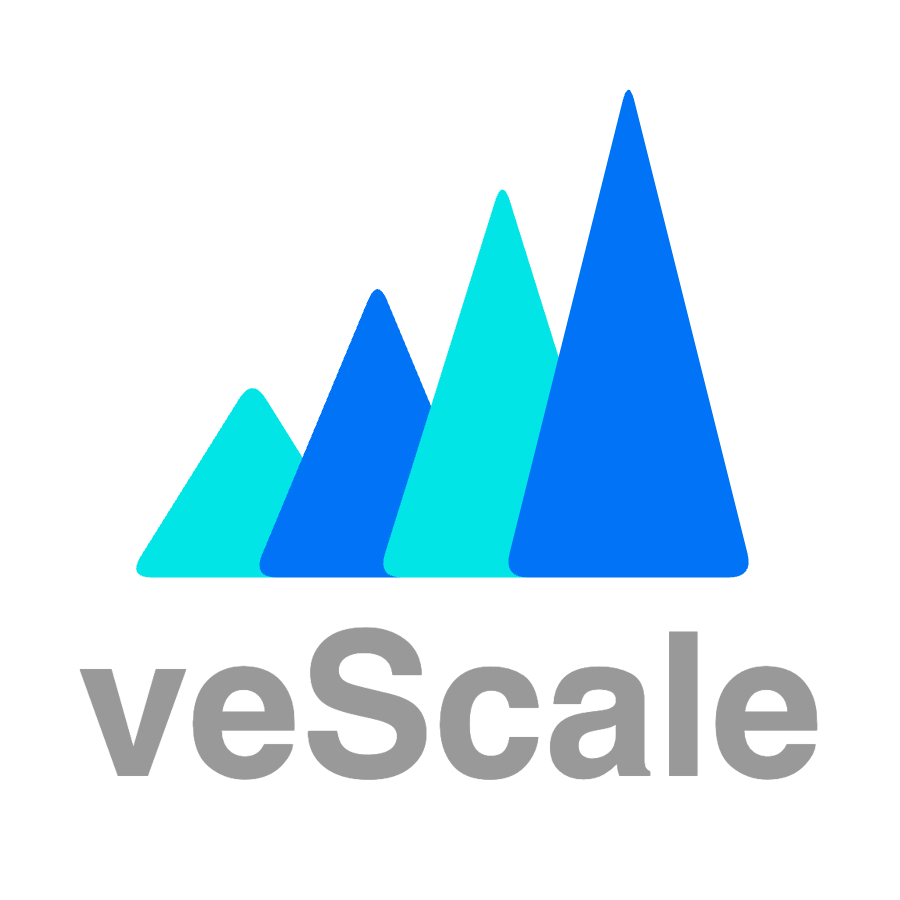

    

# A PyTorch Native LLM Training Framework

_**An Industrial-Level Framework for Easy-of-Use**_

- 🔥 **PyTorch Native**: veScale is rooted in PyTorch-native data structures, operators, and APIs, enjoying the ecosystem of PyTorch that dominates the ML world.

- 🛡 **Zero Model Code Change**: veScale decouples distributed system design from model architecture, requiring near-zero or zero modification on the model code of users.

- 🚀 **Single Device Abstraction**:  veScale provides single-device semantics to users, automatically distributing and orchestrating model execution in a cluster of devices. 

- 🎯 **Automatic Parallelism Planning**:  veScale parallelizes model execution with a synergy of strategies (tensor, sequence, data, ZeRO, pipeline parallelism) under semi- or full-automation [coming soon].

- ⚡ **Eager & Compile Mode**: veScale supports not only Eager-mode automation for parallel training and inference but also Compile-mode for ultimate performance [coming soon].

- 📀 **Automatic Checkpoint Resharding**: veScale manages distributed checkpoints automatically with online resharding across different cluster sizes and different parallelism strategies. 

## Latest News

- [2024-5-31] veScale's [fast checkpointing system](https://github.com/volcengine/veScale/blob/main/vescale/checkpoint/README.md) open sourced with automatic checkpoint resharding, caching, load-balancing, fast copying, deduplicating, and asynchronous io.

- [2024-5-21] veScale's examples ([Mixtral](https://github.com/volcengine/veScale/tree/main/examples/mixtral_4D_training), [LLama2](https://github.com/volcengine/veScale/tree/main/examples/llama2_4D_finetune), and [nanoGPT](https://github.com/volcengine/veScale/tree/main/examples/nanogpt_4D_finetune)) open sourced with bit-wise correctness of training loss curves.

- [2024-5-13] The debut of veScale in MLSys 2024 as a [poster](https://volcengine.github.io/veScaleWeb/blog/mlsys2024.html).

- [2024-4-16] Our [internal LLM training system](https://volcengine.github.io/veScaleWeb/blog/megascale.html) presented in NSDI 2024.

## Coming Soon

_**veScale**_ is still in its early phase. We are refactoring our internal LLM training system components to meet open source standard. The tentative timeline is as follows:

- by end of July, CUDA event monitor, pipeline parallelism and supporting components for large-scale training

## Table of Content ([web view](https://volcengine.github.io/veScaleWeb/))

**[Introduction](./docs/texts/introduction.md)**

**[Quick Start](./docs/texts/quick-start.md)**

**[DTensor](./vescale/dtensor/README.md)**

**Parallel**
  * [Overview](./docs/texts/parallel_overview.md)
  * [Tensor Parallel & Sequence Parallel](./vescale/dmodule/README.md)
  * [Data Parallel](./vescale/ddp/README.md)
  * [Optimizer Parallel](./vescale/optim/README.md)
  * [Pipeline Parallel](./vescale/pipe/README.md)
  * [nD Device Mesh](./vescale/devicemesh_api/README.md)

**Plan**
  * [Auto TP & SP Plan](./vescale/dmp/README.md)

**[Checkpoint](./vescale/checkpoint/README.md)**

## [We Are Hiring!](https://volcengine.github.io/veScaleWeb/misc/join-us.html) ##

## [License](./LICENSE)

The veScale Project is under the Apache License v2.0.