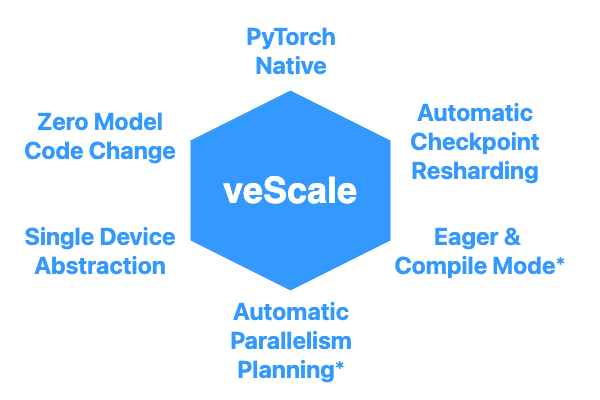
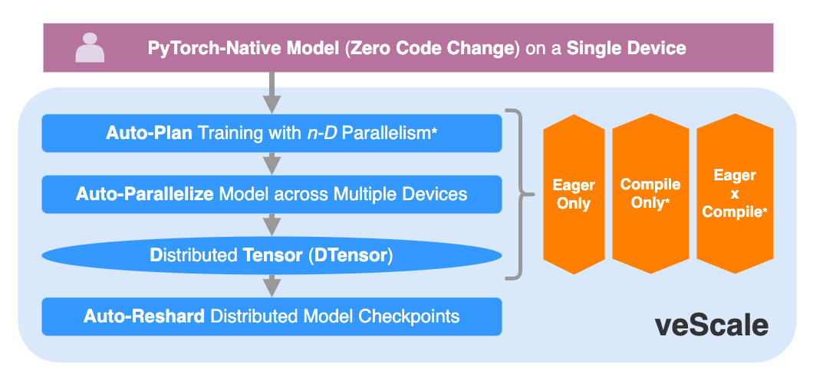

# veScale: A PyTorch Native LLM Training Framework

## TLDR

An _**Industrial-Level**_ Framework for _**Easy-of-Use**_:

(`*` is under development.)

## Why veScale

The era of giant models today calls forth distributed training.
Despite countless distributed training frameworks that have been published in the past decade (to name a few), few have excelled at the _**Ease-of-Use**_ and development extensibility demanded by real industry production,
as the quality most favored for a framework is often the _**Ease-of-Use**_ instead of pure _Performance_. 
Companies developing 100s~1000s models a week benefit the most from a framework that is both easy to use and extend, and provides elegant encapsulation of models and clean APIs.

The _**Ease-of-Use**_ of a framework for training and developing LLM lies in the following essentials:

- 🔥 **PyTorch Native**: _PyTorch_ ecosystem dominates the ML world and owns 92% of models on _HuggingFace_ and 70% of research on _Papers with Code_; Alienating from _PyTorch_ ecosystem makes a framework hard to adapt and extend.

- 🛡 **Zero Model Code Change**: Users' model code should remain untouched, instead of being intertwined with framework code, which requires users to not only manually rewrite the model for distributed training with tons of care, but also painfully debug within the deep coupled model and framework code.

- 🚀 **Single Device Abstraction**: Model developers should focus on developing model architecture itself with single device semantics, rather than being distracted by the complex and error-prone management of multiple devices and diverse interconnects in distributed environments.

- 🎯 **Automatic Parallelism Planning**: Gigantic models cannot be trained without _nD Parallelism_ (_Tensor, Sequence, Data, ZeRO, Pipeline Parallelism, etc._). Users' giant models should be automatically scaled by a framework for _nD_ parallel training, instead of being manually planned and tuned for each operator or layer under different cluster settings, which takes forever. 

- ⚡ **Eager & Compile Mode**: Users should enjoy both _Eager_ and _Compile_ mode offered by a framework with:
  - _Eager_ mode for fast development, convenient debugging, and customization with callbacks and control flows;
  - _Compile_ mode for ultimate performance boost with a single click.

- 📀 **Automatic Checkpoint Resharding**: Training models and optimizer states should be saved/loaded automatically and performantly in distributed settings, and can even be _online resharded_ across different cluster sizes and different _nD Parallelism_.

## What is veScale

**veScale**'s overview is as follows:

We take an initial step to develop an _**Industry-Level**_ framework, **veScale**, that focuses _**Ease-of-Use**_ for scaling LLM training, by combining _PyTorch Nativeness_ and _Automatic Parallelism*_. 

Ideally, **veScale** only expects model developers to write a simple model code with native _torch.nn.Module_ under _Zero Code Change_ as if running on a _Single Device_, and then **veScale** will automatically parallelize it across a cluster of devices in a _nD Parallelism_ search space with all the optimizations and heavy lifting handled transparently.

Unlike existing frameworks that rely on _Compile_ mode and a "perfect model graph" for _Automatic Parallelism_,  **veScale** is inventing an _Eager-Mode-ONLY*_ _Automatic Parallelism_ that does not rely on the model graph at all. 
Furthermore, **veScale** is also developing a _Mixed Mode_* of partial _Eager_ and partial _Compile_.

**veScale** is designed and implemented on top of a primitive called _DTensor_ that provides a global tensor semantic with local shards distributed on multiple devices.
**veScale** extends and enhances the _PyTorch DTensor_ for our production standard, and further develops the _Auto-Plan*_ and _Auto-Paralleize_ with a unified configuration and API. 

Furthermore, **veScale** also supports online _Auto-Reshard_ for distributed checkpoints.

(`*` is under development)

## Status of veScale

**veScale** is still in its early phase.

The tentative open-source timeline can be found in the **veScale** [**repo**](https://github.com/volcengine/veScale/tree/main).