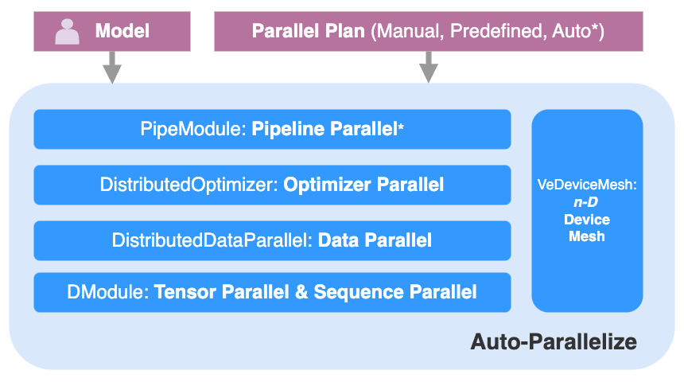

# veScale Parallel Overview

The overview of veScale _n-D parallelism_ is as follows:



(`*` is under development)

The _Auto-Parallelize_ block takes the untouched _Model_ from the user and _Parallel Plan_ (given by manual effort, prefined for each model type, or automatically generated from _Auto-Plan*_) and then parallelizes the single-device model into _nD Parallelism_ across a mesh of devices. 

veScale's _nD Parallelism_ follows a decoupled design where each D of parallelism is handled by an independent sub-block (e.g., _DModule_ only handles _Tensor & Sequence Parallel_, without coupling with other _Parallel_). 
In contrast to the conventional _coupled_ design that intertwines all parallelism together, such a _decoupled_ _nD Parallelism_ enjoys composability, debuggability, explainability, and extensibility, all of which are of great value for hyper-scale training in production.

## 4D Parallelisim API

Our 4D parallelism (_Tensor, Sequence, Data, and ZeRO2_) is as follows:

``` python
# zero model code change
from <HuggingFace> import <ModelCls>, <ModelArgs>

# create fake model without actual memory usage (optional)
fake_model = deferred_init(<ModelCls>, <ModelArgs>)

# initialize 4D device mesh
mesh = init_device_mesh("cuda", (dp_zero_size, tp_sp_size), mesh_dim_names=["DP_ZERO", "TP_SP"])

# parallelize model in tp & sp
from <PredefinedPlan> import sharding_plan
real_tp_sp_model = parallelize_module(fake_model, mesh["TP_SP"], sharding_plan)

# parallelize model in dp
ddp_model = DDP(real_tp_sp_model, mesh["DP_ZERO"])

# parallelize model with zero2
doptimizer = DistributedOptimizer(torch.optim.AdamW, models=[ddp_model])

# train model as if on a single device
for x in range(dataset):
    loss = ddp_model(x)
    loss.backward()
    doptimizer.step()
    doptimizer.zero_grad()
```

More examples can be found in: `<repo>/examples/`.

## 5D Parallelisim API

Coming Soon
