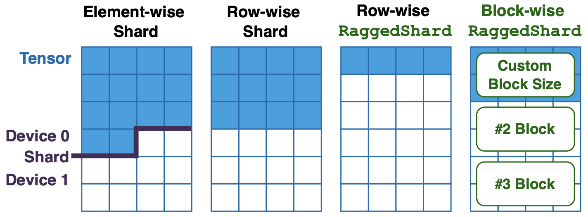
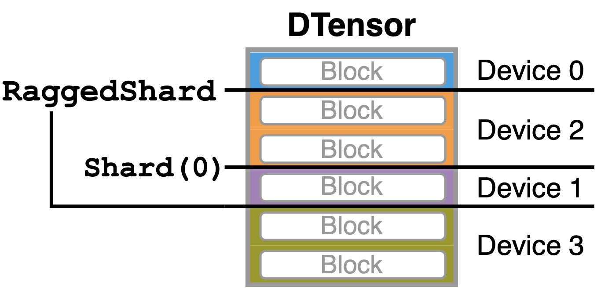
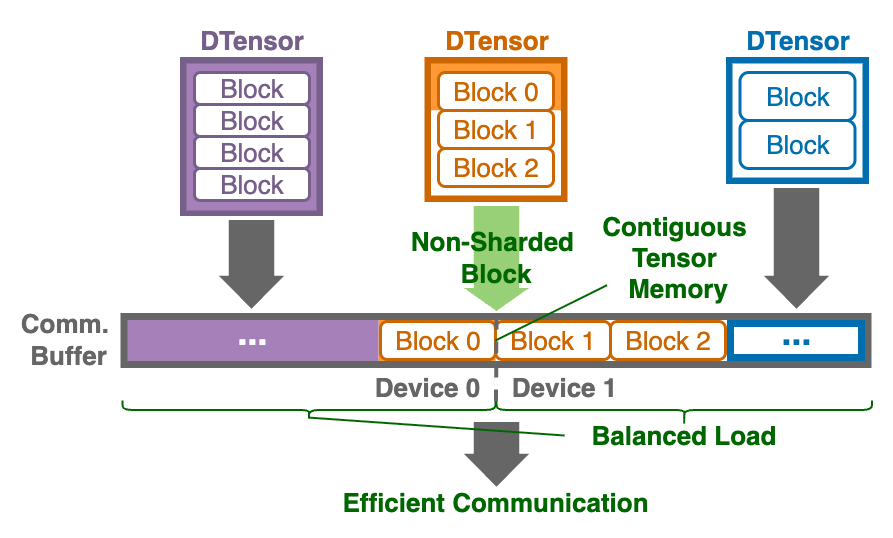
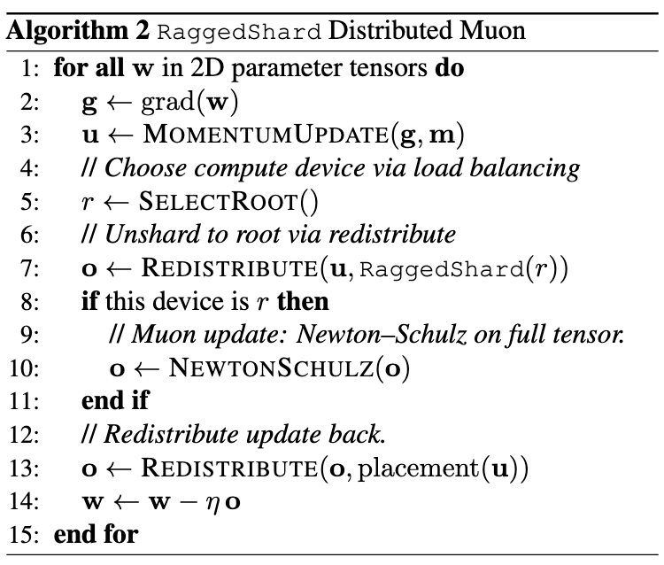

# RaggedShard Placement

This document introduces **`RaggedShard`**, a new placement for PyTorch DistributedTensor (`DTensor`). Existing `Shard` placement can only express symmetric sharding across devices. `RaggedShard` extends the `Shard` to natively express asymmetric sharding. This enables the flexibility required by modern LLM workflows, such as communication-efficient Fully Sharded Data Parallel (FSDP), block-wise quantized training, structure-aware distributed optimizers, communication-efficient distributed checkpointing, and uneven sharded activations in Mixture-Of-Expert.

## Concept

Conventionally, FSDP1 expresses sharded tensor as element-wise shard, while FSDP2 and `Shard` expresses symmetric row-wise shard. By contrast, `RaggedShard` generalizes them by offering flexible expression of arbitrary sharding granularity over contiguous memory. This enables new asymmetric row-wise sharding and customizable block-wise sharding.



## Definition

`RaggedShard` inherits from DTensor `Placement` to express flexible sharding as follow:

```python
class RaggedShard(Placement):
    """
    The ``RaggedShard`` placement specifies DTensor sharding based on tensor
    memory continuity.

    Args:
        dims (tuple[int]): The prefix dimension(s) to shard.
            For example, if a tensor of shape (n, m, k) is ragged-sharded with
            dims=(0, 1), then each ``local_tensor.numel()`` is guaranteed to be
            a multiple of k.
        local_units (tuple[int]): A tuple of integers specifying the relative
            allocation of elements across shards. The length of the tuple must
            equal ``mesh.size(dim)``.

            For example, ``local_units=(1, 2, 1, 1)`` assigns:
            - 20% of elements to device 0
            - 40% to device 1
            - 20% each to devices 2 and 3
    """

    dims: tuple[int, ...]
    local_units: tuple[int, ...]
```

By configuring `dims` and `local_units`, `RaggedShard` can express element-wise, symmetric/asymmetric row-wise, and block-wise sharding granularities.

## Capabilities

`RaggedShard` natively supports DTensor operations, similar to `Shard`:

1. **Redistribution (Communication)**: Users can utilize the native `DTensor.redistribute()` API to reshard a DTensor between any two placements with transparent communication:
    - `RaggedShard` to `RaggedShard`
    - `RaggedShard` to `Replicate`/`Shard`/`Partial`
    - `Replicate`/`Shard`/`Partial` to `RaggedShard`

2. **Element-wise Computation**: Users can directly run element-wise computations on a `RaggedShard` DTensor, including addition, subtraction, multiplication, and division, as well as optimizers like AdamW.

3. **Reduction Computation**: Users can directly run cross-device reduction operation on a `RaggedShard` DTensor, including averaging, normalization, as well as `clip_grad_norm_`.

## Composability

`RaggedShard` is fully composable with standard DTensor placements to form N-dimensional parallelism. For example, `RaggedShard` can be composed with `Shard` to express 2D parallelism:



Conceptually, `RaggedShard` composes cleanly with standard DTensor placements. In practice, however, implementation is non-trivial due to a mismatch between how parallelism is logically applied (e.g., using `Shard(0)`/`Shard(1)` for Tensor Parallelism and `Shard(0)` for Expert Parallelism along the expert dimension, typically applied before FSDP) and how DTensor actually orders placements. A tensor expressed as `(RaggedShard, Shard(0))` is partitioned by `Shard(0)` first and then by `RaggedShard`, which conflicts with the intended device-mesh dimension order. To reconcile this, we explicitly handle the resulting reordering:
- For `Shard(0)`, we introduce `StridedRaggedShard`: an analogue of `StridedShard`. This supports variable local chunk sizes while recording the permutation, allowing the correct tensor layout to be reconstructed. 
- For `Shard(dim > 0)`, we select the ragged sharding granularity to ensure it never "cuts through" that dimension. For example, we set the granularity to the least common multiple (LCM) of the original granularity and `tensor.stride(dim)`. This makes `RaggedShard` orthogonal to `Shard(dim > 0)`, ensuring the DTensor placement order does not affect the logical parallelism semantics.

## Applications

### Communication-Efficient FSDP

A primary motivation for `RaggedShard` is the efficient communication of sharded parameters in FSDP. The existing symmetric `Shard` incurs the expensive overhead of interleaved copying during batched communication of FSDP parameters. `RaggedShard` addresses this with **native asymmetric sharding**. To maximize communication efficiency, modern FSDP implementations batch all parameters in a module for collective operations. `RaggedShard` allows parameters to be flattened and sharded across a subset of devices, enabling zero-copy collective communication. The figure below illustrates batched communication of `RaggedShard` DTensors in FSDP.



### Block-wise Quantized Training

Quantized training is essential for improving training efficiency, yet diverse quantization granularities (different block sizes) pose a challenge for DTensor sharding representation. Users are often restricted in model design to avoid across-device sharding within quantization blocks, or forced to modifying complex system libraries to manually synchronize sharded quantization blocks across devices.

`RaggedShard` solves this by natively expressing DTensor with **customizable sharding blocks**, where each tensor is logically partitioned into many blocks and each block is not sharded across devices. In the context of quantized training, the previous figure shows that each `RaggedShard` DTensor parameter specifies its own sharding block containing quantization block (which must be sharded locally), while the parameter storage is packed into a contiguous buffer for efficient collectives and memory management. For instance, in 32x32 block-wise quantization, the `RaggedShard` sharding block can be set to 32 rows (the minimal continuous memory size). FSDP can then map parameters into a global continuous buffer that respects this sharding granularity.

### Structure-Aware Distributed Optimizer

Structure-aware optimizers (e.g., Shampoo and Muon) are critical training technique empowering state-of-the-art models like Gemini and Kimi. However, training sharded parameters with structure-aware optimizers is non-trivial. For instance, Muon optimizer utilizes a matrix-sign preconditioner (e.g., Newton–Schulz) that requires access to the full 2D parameter matrix in its original unsharded shape.

`RaggedShard` facilitates this through its **native redistribution API**. Users can simply call `DTensor.redistribute` to convert any DTensor parameter into a `RaggedShard` placement where a single device holds the full parameter. Since `RaggedShard` supports asymmetric sharding abstractions, it represents Muon’s parameter-gather step as a clean SPMD operation:
1.  **Gather**: The algorithm selects a root device (via load balancing) and unshards parameters to it using `DTensor.redistribute` with `RaggedShard`.
2.  **Compute**: The Muon matrix iteration runs locally on the root holding the full tensor.
3.  **Scatter**: The updates are redistributed back to the original devices using original placements.

`RaggedShard` abstracts away manual communication logic and allows for overlapping communication with computation via asynchronous redistribution:




### Communication-Free Distributed Checkpiont

The `RaggedShard` placement natively supports PyTorch Distributed Checkpoint (DCP). We implement the DTensor chunk-list interface analogously to the `Shard` placement but compute chunk metadata from ragged local units so that variable local lengths are correctly represented. Consequently, `RaggedShard` eliminates the extra resharding communication found in legacy FSDPs (e.g., FSDP1) by persisting local shards directly, all while preserving DCP’s flexibility to reload checkpoints under different cluster sizes and sharding placements.

### Mixture-Of-Expert Activations

`RaggedShard` can potentially express the token activations that are asymmetrically sharded across devices -- a common pattern in Mixture-Of-Expert (MoE) architectures. This enables a native DTensor representation of MoE training and paves the way for future auto-parallelism support.
