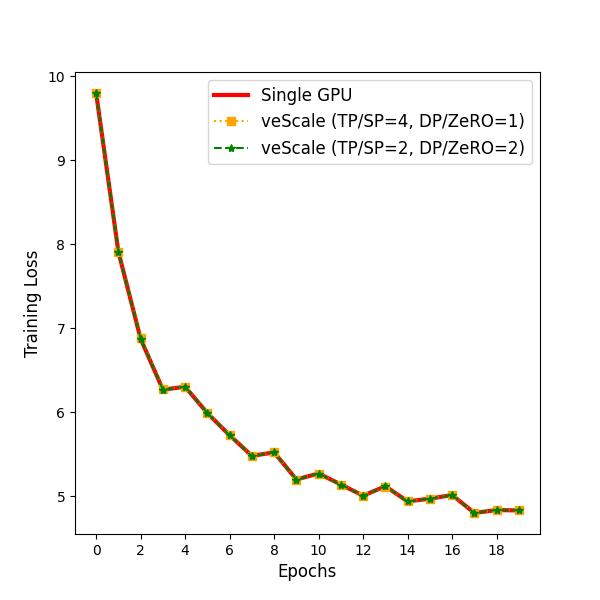

# Finetune a Llama2 3b model in 4D parallelism using veScale

## Overview

Finetune a pretrained llama2_3b model on a small Shakespeare dataset.
Dropout is set to 0 for this model, thus no randomness is involved during finetuning.
The reason for choosing llama2_3b instead of the 7b one is that it fits in 1 GPU so that we can check the correctness of veScale.

## Prerequisite

```
pip3 install sentencepiece
```

## Run

```
cd data/shakespeare/ && python3 prepare.py && cd ../..
torchrun --standalone --nproc_per_node={GPU_CNT} llama_train.py --dp={dp_size} --tp={tp_size} --max_iters={max_iters}
```

## Experiments

Like nanoGPT, we finetune the model with a constant learning rate `3e-5` and set `grad_clip = 1`.
The model state as well as the gradients and the optimizer states are in `bf16`.




## Caveats

1. Currently, it does not works with `transformers==4.38.2`. The error happens when doing a backward step, the `aten._scaled_dot_product_efficient_attention` operator outputs the error message: `attn_bias: wrong shape (head dimension)`.