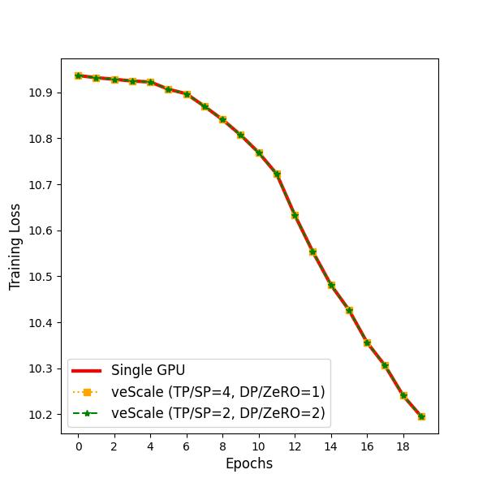

# veScale Mixtral Example

## Overview

Train a Mixtral model on a small Shakespeare dataset.
We use a constant learning rate and clip grad at `1`.
`attention_dropout` is set to `0` by default.

## Run

```
cd data/shakespeare/ && python3 prepare.py && cd ../..
torchrun --standalone --nproc_per_node={GPU_CNT} mixtral_train.py --dp={dp_size} --tp={tp_size} --max_iters={max_iters}
```

## Experiments

We run the training process on 1 GPU and 4 GPUs respectively.
Everying including model params, gradients, and the optimizer states are in `bf16`.





## Caveats
1. To examine correctness by comparing with single GPU runs, we are working with a smaller Mixtral MOE model on only 70M parameters that fits in a single A100 with 80GB memory.