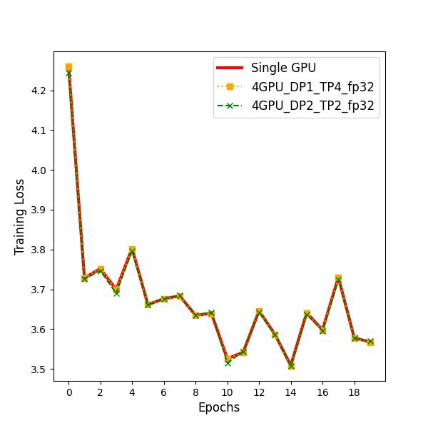
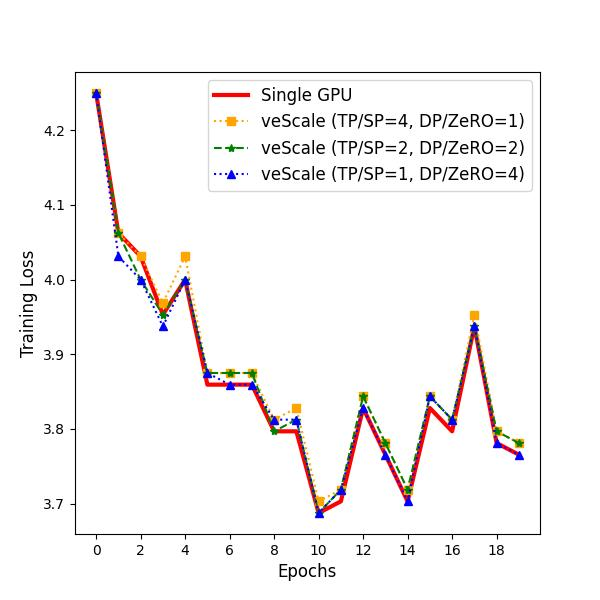
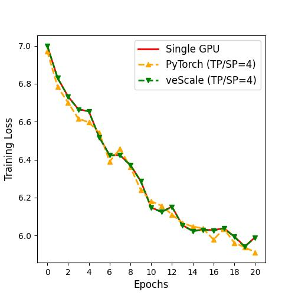

# Finetune nanoGPT on Shakespeare in 4D Parallelism via veScale

In this example, we demonstrate how to finetune a pre-trained GPT2 using veScale. The example is built upon @karpathy's [nanoGPT](https://github.com/karpathy/nanoGPT/) project. With near-zero change in the model code and minimal changes in the training code, we can finetune a pre-trained GPT2 on the Shakespeare dataset and utilize multiple GPUs via 4D parallelism: Data, Tensor, Sequence, and Optimizer Parallelism. The correctness of our implementation is verified via comparing both the training and the validation loss with the single GPU result produced by nanoGPT. The differences is negligible when the computation is conducted using fp32, ~1% using bf16.

## Prerequisite

```
pip3 install tiktoken datasets
```

## Run

First, prepare the dataset:
```
cd data/shakespeare && python3 prepare.py
```

Then, to finetune the Shakespeare dataset in an environment of multiple GPUs, run
```
torchrun --standalone --nproc_per_node={Number of GPUs} finetune_4D.py config/finetune_shakespeare.py --compile=False --dp_size={DP Size} --tp_size={TP Size} --save_checkpoint_path={path to save checkpoints} 
```
where `DP Size` and `TP Size` denote the the degrees of Data and Tensor Parallelism that suit your environment, `save_checkpoint_path` is path to save checkpoints during the training.  

If you want to resume training from a checkpoint, add `--load_checkpoint_path={path to load checkpoint}` in the command.

For example:
```
torchrun --standalone --nproc_per_node={Number of GPUs} finetune_4D.py config/finetune_shakespeare.py --compile=False --dp_size={DP Size} --tp_size={TP Size} --save_checkpoint_path=./nanogpt_checkpoint_dir  --load_checkpoint_path=./nanogpt_checkpoint_dir/iter_5
```


To produce the single GPU result, run
```
python3 base_train.py config/finetune_shakespeare.py --compile=False
```

## Loss Curves

Here are the training loss curves plot for fp32 runs that last 20 iterations:



For the bf16 runs, in `base_train.py`, instead of using `torch.amp.autocast`, we cast the model to bf16 directly and both the gradients and the optimizer states are casted to bf16 automatically. For a fair comparison, we modify veScale to store both the gradients and the optimizer state in bf16 instead of fp32.





## Difference from the upstream nanoGPT

1. veScale enables EXACT single-device abstraction for multiple device training, where even random operator (e.g., Dropout) with Tensor Parallel achieves exact training loss as a single device training. This is achieved via our veScale DTensor and patched torch. Without veScale DTensor, upstream DTensor does NOT provide single device semantics on random operators. The comparison is as follows:





In this figure, the `1GPU_fp32` curve is shifted in y-axis by 0.01 in order to distinguish it from the `4GPU_TP4_veScale` curve.

2. When training with bf16 (`--dtype='bfloat16'`), the model is casted to bf16 and we remove the usage of `amp.autocast`.

3. Sampling mini-batches is done at the 0th rank and the indices is later broadcasted to other ranks. This ensures that both `base_train.py` and `finetune_4D.py` works on the identical batch every iteration.

## Caveats

1. `torch.compile` for veScale is still experimental. We run the single GPU baseline with the `compile` flag off.

2. veScale does not focus on fp16, as fp16 is ancient in industry.

3. Checkpointing is supported now.