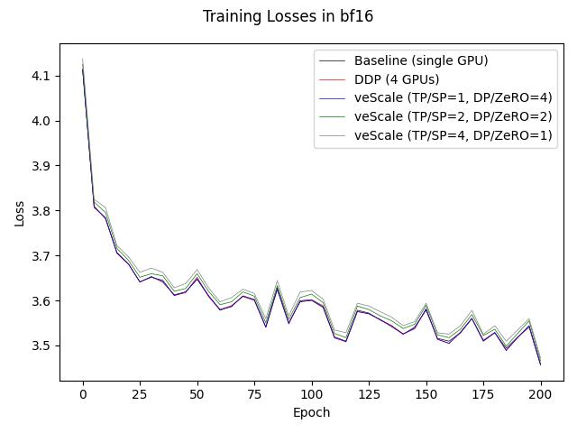
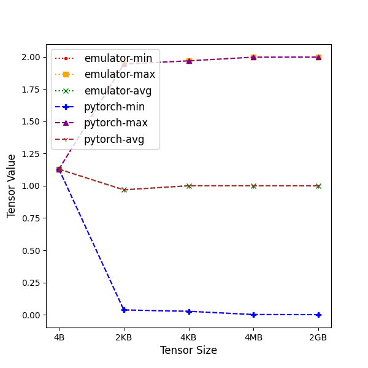
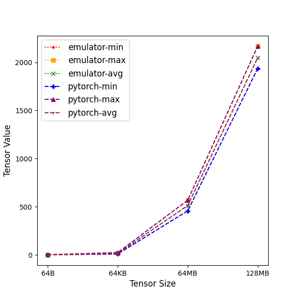

# veScale Correctness Emulator
This folder contains **veScale Correctness Emulator** that emulates the results from multiple devices execution on a single device.

## TLDR


## Why veScale Correctness Emulator?
- Modern Frameworks promise **Single-Device Abstraction** for **nD Parallelism**!
  - Google's GSPMD + JAX
  - PyTorch's torch.titan
  - OneFlow
  - ByteDance's veScale
- But it is still missing a critical component that can verify the ***correctness*** of **Single-Device Abstraction of nD Parallelism**. 
    - Difference between the loss curve of single device training and loss curves of 3D parallelism training.
    
    - How do we know the difference is *correct*? To what extent is it *correct*?
        - "Correct" differences come from nD Parallelism
            - Communication difference (e.g., ring allreduce)
            - Compute difference (e.g., matmul)
            - Hardware difference (e.g. FP16)
        - "Incorrect" differences come from bugs in
            - User configuration
            - User model code
            - System implementation code
            - Data loader
            - Model checkpoint
            - Random seed and offset


## What is veScale Correctness Emulator?

- **veScale Correctness Emulator** verifies nD prarllelism correctness by emulating nD parallel training on a single device,
- **veScale Correctness Emulator** isolates correctness at different layers and seperates differences come from nD parallelism with differences come from bugs.
- **veScale Correctness Emulator** achieves bitwise correctness in three levels: NCCL collectives, mesh collectives, and DTensor.

### NCCL Emulation
We are using the NCCL version 2.19.3 code as a reference for our emulation implementation. The code can be found at [NVIDIA/nccl](https://github.com/NVIDIA/nccl/tree/v2.19.3-1).

**veScale Correctness Emulator** can perfectly emulate NCCL collective APIs' results. This is achieved by implementing the same NCCL collective algorithms and modeling NCCL's computation order via calculating the correct chunk size.

### Collective APIs Emulation
These are standalone collective APIs which emulate the results from collective APIs of NCCL on a single device.
Supported APIs:
- `all_reduce`
- `all_gather`
- `reduce_scatter`
- `all_to_all`

### Mesh Collective APIs Emulation
These are standalone mesh collective APIs which emulate the results from mesh collective APIs of PyTorch on a single device.
Supported APIs:
- `mesh_all_reduce`
- `mesh_all_gather`
- `mesh_reduce_scatter`
- `mesh_all_to_all`
- `mesh_broadcast`
- `mesh_scatter`

### DTensor Redistribution Function Emulation
These are standalone DTensor redistribution functions which emulate the results from DTensor redistribution functions of PyTorch on a single device.
- `R2R`
- `R2S`
- `S2R`
- `P2R`

Comming soon: A full list of emulator DTensor redistribution functions will be added to support nD parallelisms including DP, TP, SP, PP, EP, and OP.

## How does veScale Correctness Emulator work?
**veScale Correctness Emulator** achieves bitwise correctness in emulating NCCL collectives APIs results. This is done by implementing the same NCCL collective algorithms and modeling NCCL's algorithm and protocol selection function and chunk size calculation process to ensure the same computation order as NCCL.

Based on the emulation functions for NCCL collectives, **veScale Correctness Emulator** implements a global-view emulator `ProcessGroup` and `DeviceMesh` that contain all the process groups in the enviroment, while PyTorch's `ProcessGroup` and `DeviceMesh` only view process groups related to the current ranks.

Aided by the global-view emulator `ProcessGroup` and `DeviceMesh`, **veScale Correctness Emulator** can emulate the results of collective APIs, mesh collective APIs, and DTensor redistribution functions on a single device.

## How to use veScale Correctness Emulator?
- To achieve bitwise correctness in emulating NCCL collectives APIs results, we need to first dump NCCL's topological graph. It contains important hardware topology information such as `nchannels`, `bwIntra`, `bwInter`, `latencyInter` which is used in accurate chunk size modeling.
```python
import torch.distributed as dist
import vescale.emulator.distributed as emulatordist
import vescale

# Dump graph for ProcessGroup
dist.init_process_group(backend="nccl", rank=local_rank, world_size=world_size)
emulatordist.init_process_group(backend="nccl", world_size=world_size)
pg = emulatordist._get_default_group()
torch_pg = dist.distributed_c10d._get_default_group()
emulatordist.dump_nccl_graph_for_pg(pg, torch_pg, local_rank)

# Dump graph for DeviceMesh
vescale_mesh = vescale.dtensor.device_mesh.DeviceMesh(device_type, mesh_tensor)
mesh = vescale.emulator.device_mesh.DeviceMesh(device_type, mesh_tensor)
vescale.emulator.device_mesh.dump_nccl_graph_for_mesh(mesh, vescale_mesh)

```

- Example of emulating standalone NCCL's collective APIs' results
```python
import torch
import vescale.emulator.distributed as dist 
from vescale.emulator.reduce_kernel import ReduceOp

# Initialize an emulator ProcessGroup
dist.init_process_group(backend="nccl", world_size=world_size)

# Create a list of tensors for the collective operation
data_list = [torch.rand(1024).cuda() for _ in range(world_size)]
reduce_op = ReduceOp.SUM
tree_structure = [[0, 1, 2, 3]]  # This 2D list represents one node with four GPUs

# Perform all_reduce on the list of input tensors
pg = dist._get_default_group()
pg.all_reduce(
    data_list, 
    op=reduce_op, 
    tree_structure=tree_structure
)
```
For the complete collective API emulation example, please refer to [collectives unit tests](../../test/emulator/test_distributed.py).

- Example of emulating standalone mesh collective APIs' results
```python
import torch
from vescale.emulator.device_mesh import DeviceMesh
from vescale.emulator.mesh_collectives import mesh_all_reduce
from vescale.emulator.reduce_kernel import ReduceOp

# Initialize an emulator DeviceMesh
mesh = DeviceMesh("cuda", [[1, 2], [3, 4]])

# Create a list of tensors for the collective operation
data_list = [torch.rand(1024).cuda() for _ in range(world_size)]
reduce_op = ReduceOp.SUM
mesh_dim = 0
tree_structure = [[0, 1, 2, 3]]  # This 2D list represents one node with four GPUs

# Perform mesh_all_reduce on the list of input tensors
result = mesh_all_reduce(
    data_list, 
    mesh, 
    reduce_op, 
    mesh_dim, 
    tree_structure=tree_structure
)

```
For the complete mesh collective API emulation example, please refer to [mesh collectives unit tests](../../test/emulator/test_mesh_collectives.py).

- Example of emulating DTensor's results from torch function `torch.mm`
```python
from vescale.emulator.device_mesh import DeviceMesh
from vescale.emulator.comm_api import distribute_tensor, redistribute_dtensor 
from vescale.emulator.emulator_instrumentation import EmulatorInstrumentation

# Initialize an emulator DeviceMesh
mesh = DeviceMesh("cuda", [[1, 2, 3, 4]])

# Create a list of DTensor with coresponding placement from a list of Tensor
dt1_list = distribute_tensor(t1_list, device_mesh, [Shard(dim=1)])
dt2_list = distribute_tensor(t2_list, device_mesh, [Shard(dim=0)])

# Replace all the given torch functions by wrapper functions that iterate 
# the torch functions on the lists of DTensor arguments
func_list = ["mm"]
indices = [(0, 1)]
with EmulatorInstrumentation(torch, func_list, indices):
    # Shard(dim=1) multipled by Shard(dim=0) and gets Partial()
    dist_res_list = torch.mm(dt1_list, dt2_list)  
    # Calls P2R redistribution function to get Replicate()
    dist_res_list = redistribute_dtensor(dist_res_list, device_mesh, [Replicate()])  


```
For the complete DTensor emulation example, please refer to [DTensor unit tests](../../test/emulator/test_dtensor.py).


## veScale Correctness Emulator Bitwise Match Results
- Bitwise comparison between the results of the emulator's `all_reduce` operation and PyTorch's `all_reduce` operation across 4 GPUs, using randomly generated tensors of the `torch.float32` data type with varying sizes. The comparison includes the `min`, `max`, and `avg` values of the resulting tensors to evaluate the bitwise equivalence of the operations.
    - Figure:
    
    
    - Result:

| tensor size  | 4B                        | 2KB                       | 4KB                       | 4MB                       | 2GB                       |
| ------------ | ------------------------- | ------------------------- | ------------------------- | ------------------------- | ------------------------- |
| emulator-min | 2.44264364242553710937500 | 0.45483720302581787109375 | 0.31362706422805786132812 | 0.07745391130447387695312 | 0.00967526435852050781250 |
| emulator-max | 2.44264364242553710937500 | 3.51578140258789062500000 | 3.47223615646362304687500 | 3.94559144973754882812500 | 3.98580169677734375000000 |
| emulator-avg | 2.44264364242553710937500 | 2.00266790390014648437500 | 1.94976377487182617187500 | 2.00139284133911132812500 | 2.00001406669616699218750 |
| pytorch-min  | 2.44264364242553710937500 | 0.45483720302581787109375 | 0.31362706422805786132812 | 0.07745391130447387695312 | 0.00967526435852050781250 |
| pytorch-max  | 2.44264364242553710937500 | 3.51578140258789062500000 | 3.47223615646362304687500 | 3.94559144973754882812500 | 3.98580169677734375000000 |
| pytorch-avg  | 2.44264364242553710937500 | 2.00266790390014648437500 | 1.94976377487182617187500 | 2.00139284133911132812500 | 2.00001406669616699218750 |

- Bitwise comparison between the emulator's `mesh_all_reduce` and veScale's `mesh_all_reduce` operations on 4 GPUs. The experiments were executed using a `DeviceMesh` configuration with `TP=2` and `DP=2`, performing `mesh_all_reduce` along mesh dimension 0. The input data consisted of randomly generated tensors of varying sizes in the `torch.float32` data type. We present the `min`, `max`, and `avg` values of the resulting tensors to evaluate the bitwise consistency of the operations.
    - Figure:
    
    
    - Result

| tensor size  | 4B                        | 2KB                       | 4KB                       | 4MB                       | 2GB                       |
| ------------ | ------------------------- | ------------------------- | ------------------------- | ------------------------- | ------------------------- |
| emulator-min | 1.12971544265747070312500 | 0.03645843267440795898438 | 0.02600371837615966796875 | 0.00088638067245483398438 | 0.00005841255187988281250 |
| emulator-max | 1.12971544265747070312500 | 1.94575321674346923828125 | 1.97041249275207519531250 | 1.99889516830444335937500 | 1.99988579750061035156250 |
| emulator-avg | 1.12971544265747070312500 | 0.96918821334838867187500 | 1.00050532817840576171875 | 1.00046503543853759765625 | 1.00000810623168945312500 |
| pytorch-min  | 1.12971544265747070312500 | 0.03645843267440795898438 | 0.02600371837615966796875 | 0.00088638067245483398438 | 0.00005841255187988281250 |
| pytorch-max  | 1.12971544265747070312500 | 1.94575321674346923828125 | 1.97041249275207519531250 | 1.99889516830444335937500 | 1.99988579750061035156250 |
| pytorch-avg  | 1.12971544265747070312500 | 0.96918821334838867187500 | 1.00050532817840576171875 | 1.00046503543853759765625 | 1.00000810623168945312500 |

- Bitwise comparison between the emulator's `DTensor` redistribution and veScale's `DTensor` redistribution on 4 GPUs. The experiment involved executing `torch.mm` on two DTensors, where the first DTensor was sharded along dimension 1 (`Shard(dim=1)`) and the second along dimension 0 (`Shard(dim=0)`). The results of `the torch.mm` operation were then redistributed from `Partial()` to `Replicate()` using `mesh_all_reduce`. We present the `min`, `max`, and `avg` values of the resulting tensors to assess the bitwise consistency of the redistribution.
    - Figure:
    
    
    - Result:

| tensor size  | 64B                       | 64KB                       | 64MB                        | 128MB                        |
| ------------ | ------------------------- | -------------------------- | --------------------------- | ---------------------------- |
| emulator-min | 0.59677535295486450195312 | 9.33347034454345703125000  | 456.83691406250000000000000 | 1936.85644531250000000000000 |
| emulator-max | 1.42116737365722656250000 | 23.44433212280273437500000 | 567.39196777343750000000000 | 2168.15747070312500000000000 |
| emulator-avg | 0.98043894767761230468750 | 16.13499450683593750000000 | 512.05310058593750000000000 | 2048.04589843750000000000000 |
| pytorch-min  | 0.59677535295486450195312 | 9.33347034454345703125000  | 456.83691406250000000000000 | 1936.85644531250000000000000 |
| pytorch-max  | 1.42116737365722656250000 | 23.44433212280273437500000 | 567.39196777343750000000000 | 2168.15747070312500000000000 |
| pytorch-avg  | 0.98043894767761230468750 | 16.13499450683593750000000 | 512.05310058593750000000000 | 2048.04589843750000000000000 |