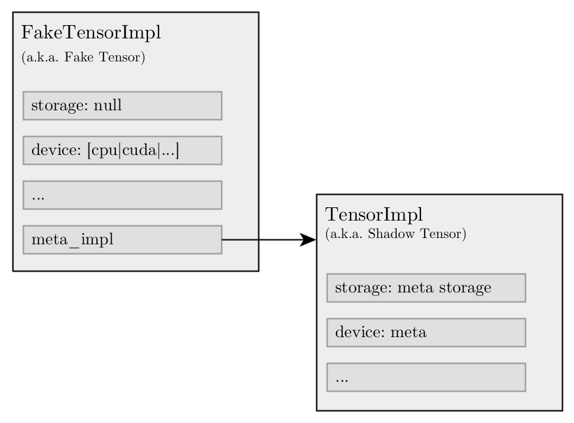
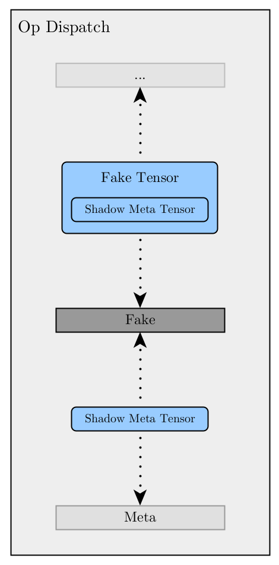
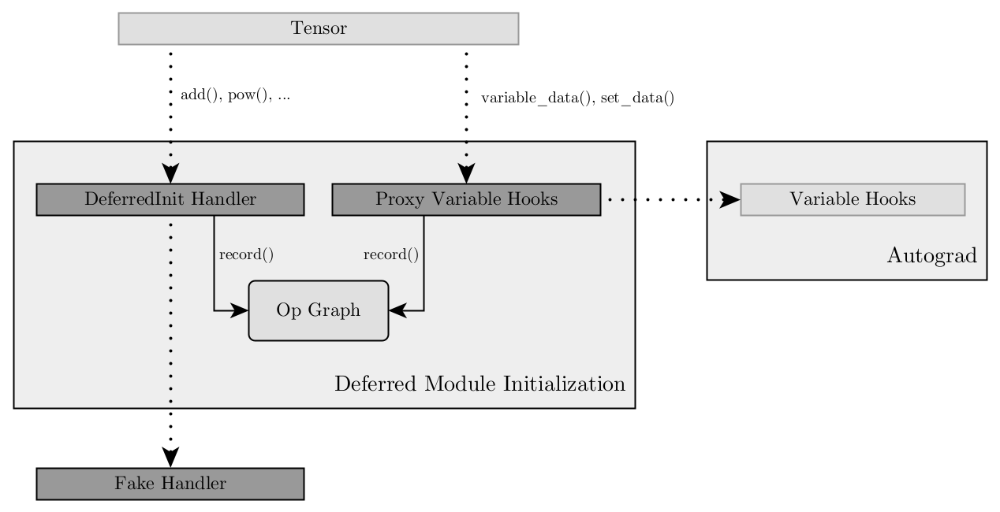

.. currentmodule:: torchdistx.deferred_init

Fake Tensors & Deferred Module Initialization
=============================================
This design note assumes that you have already read the documentation of
:doc:`deferred_init` and :doc:`fake_tensor`. In addition you are expected to be
familiar with the c10 and ATen libraries of PyTorch.

Introduction
------------
Deferred Module Initialization essentially relies on two new dispatch keys:
``Fake`` and ``DeferredInit``.

``Fake``, which will be described in detail below, is a post-autograd dispatch
key and introduces the concept of a fake tensor. Although implemented as part of
this work, it is not necessarily bound to Deferred Module Initialization and can
be used independently. On the other hand ``DeferredInit``, a pre-autograd
dispatch key, is specifically implemented for Deferred Module Initialization. It
leverages the fake tensors to skip memory allocations and at the same time
records the operations performed on those tensors in an in-memory graph. In a
sense it is a lightweight symbolic tracer built on top of fake tensors.

Fake Tensors
------------
Before diving into the technical details of the ``Fake`` dispatch key and the
fake tensors, first the motivation of why the are needed.

Problem with Meta Tensors
^^^^^^^^^^^^^^^^^^^^^^^^^
A naive implementation of ``deferred_init()`` could intercept the tensor factory
operations and replace all ``device`` arguments with the meta device to force
tensors to be allocated on the meta backend. Although this approach would work
fairly well if our goal was to solely skip initialization instead of deferring
it, there is one major problem with it once materialization comes into play.
See the following simple code snippet:

::

    >>> class MyModule(Module):
    ...     def __init__(self):
    ...         super().__init__()
    ...         self.buf1 = torch.ones([3], device="cpu")
    ...         self.buf2 = torch.zeros_like(self.buf1)

Assuming we construct ``MyModule`` inside the scope of a ``deferred_init()``
call with the aforementioned naive approach, both ``buf1`` and ``buf2`` will be
successfully allocated on the meta device as expected. However when we attempt
to materialize them, we will hit the problem:

::

    >>> materialize_tensor(my_module.buf1)
    tensor([1., 1., 1.])
    >>> materialize_tensor(my_module.buf2)
    tensor(..., device='meta')

``buf1`` will be successfully materialized on CPU, however ``buf2`` will remain
on the meta device. The problem is that the implementation of
``torch.zero_like()`` looks effectively like this:

::

    def zeros_like(src: Tensor):
        return torch.zeros(src.shape, dtype=src.dtype, device=src.device, ...)

This means when we record the operation in our internal graph the ``device``
argument that we capture for ``buf2`` will be ``Meta``, not ``CPU``.

Another similar problem happens if the module initialization has some
device-specific logic:

::

    def foo(self, device: Device) -> Tensor:
        a = torch.ones([1], device=device)

        return a if a.is_cuda else a + 1

With the naive approach the materialized version of ``a`` will always contain
``[2., 2., 2.]`` even if the specified real ``device`` was ``CUDA``. This is
because ``a`` will always be allocated on the meta device and ``is_cuda`` will
never return ``True``.

In summary in order for materialization to work properly we need a more
sophisticated approach and this is where the ``Fake`` dispatch key and the fake
tensor (i.e. ``FakeTensorImpl``) come into play.

Solution
^^^^^^^^
``FakeTensorImpl`` is a subclass of ``TensorImpl`` and behaves very similar to
``OpaqueTensorImpl`` meaning, although it is associated with a real device, it
has no storage allocated to it. However unlike ``OpaqueTensorImpl`` it also
holds an internal ``TensorImpl`` that is allocated on the meta backend that acts
as a "shadow" of the actual tensor.

The ``Fake`` dispatch key sits in-between Autograd and backend keys where its
fallback (i.e. catch-all) handler replaces any fake tensor that is passed as an
argument with its shadow meta tensor and forwards the operation to the meta
backend. Once the meta backend call returns, it performs the reverse and
replaces any shadow meta tensor with its fake tensor. Effectively dispatch keys
above ``Fake`` such as Autograd see fake tensor arguments as regular real
tensors while dispatch keys below it see them as meta tensors.

Shortcomings
^^^^^^^^^^^^
Since internally fake tensors use the meta backend, they have the same
shortcoming as regular meta tensors. If an operator has no support for the meta
backend, it will fail in a similar way for a fake tensor as well.

Another shortcoming that is unique to fake tensors is the support for
mixed-device operators. Since the ``Fake`` handler never dispatches to the
actual backend, we determine the output tensor(s) of an operator using the
following logic:

1. If the operator has a ``BackendSelect`` kernel and a ``device`` argument, we
   consider the ``device`` argument the device of the output tensor(s).
2. Otherwise; if a ``TensorOptions`` can be extracted from the arguments of the
   operator, its ``device`` is considered the output of the tensor(s).
3. Otherwise; we consider the device of the first tensor in the arguments (or
   the first element if the argument is a tensor list) as the output of the
   tensor(s).
4. If none of the above is available, we default to CPU.

Although we are not aware of any native PyTorch operator that contradicts with
this logic, it is still a heuristic and can pick the wrong device for an
unconventional operator. In the future we consider improving this implementation
by leveraging some form of tagging mechanism.

Deferred Module Initialization
------------------------------
The second dispatch key, ``DeferredInit``, is where the core logic of Deferred
Module Initialization lies. The operations performed on tensors are recorded
to a lightweight in-memory graph inside the fallback (i.e. catch-all) handler of
``DeferredInit``. In addition to recording operations, the handler also ensures
that tensor factory operations are diverted to the ``Fake`` handler by
modifying the ``DispatchKeySet`` of the call. This way all tensors constructed
within a ``deferred_init()`` call are forced to be fake.

Although this simplified description gives the main intuition behind the
``DeferredInit`` handler, there are two topics worth mentioning since they
introduce some complexity to the overall implementation.

Variable Methods
^^^^^^^^^^^^^^^^
There are three main category of functions that construct and modify tensors in
PyTorch: (1) conventional operators based on the dispatcher mechanism, (2) a
small set of regular functions such as ``torch.Tensor()``,
``torch.from_numpy()``, or ``torch.Tensor.numpy()`` that are part of the Python
API, but that don't facilitate the dispatch mechanism, (3) and lastly
``Variable`` methods such as ``torch.Tensor.set_data()`` that, mostly due to
historical reasons, leverage an alternative hook mechanism to separate Autograd
implementation from the ATen library.

With ``DeferredInit`` we are able to trace conventional operators as described
above. The non-tracebility of regular functions is a pending (low-priority)
work item that we plan to address in the future. The remaining category of
``Variable`` methods poses a problem though since there is no straightforward
way to trace them, but they are essential for the materialization of tensors. In
particular any read or write access to the ``torch.Tensor.data`` property in the
Python API, which happens quite frequently with the use of
``torch.nn.Parameter``, requires tracing of the ``variable_data()`` and
``set_data()`` functions of the ``Variable`` interface.

In order to be able to trace calls to the ``Variable`` interface, Deferred
Module Initialization uses an additional mechanism beyond just having a
dispatcher handler. As part of its prologue the ``deferred_init()`` call
"hijacks" the global ``VariableHooksInterface`` instance that is exposed by
Autograd. It wraps the instance with a proxy implementation of the interface
that records the operations and then forwards them to the original instance.
Technically this action is completely transparent to both Autograd and ATen. As
part of its epilogue ``deferred_init()`` disposes its proxy and sets back the
original instance as the global singleton.

Mutable Tensors
^^^^^^^^^^^^^^^
Another complexity is introduced by the mutable nature of PyTorch tensors. This
means our materialization logic cannot simply follow a chronological path
through a unidirectional operation graph since operations performed later in
time can still affect the output of earlier operations. Here a very simple
example:

::

    >>> a = torch.ones([2, 2])
    >>> b = a.view(-1)
    >>> a.add_(2)
    >>> b
    tensor([3., 3., 3., 3.])

Although ``a.add_()`` happens later in time than ``a.view()`` the output of
``b`` is still affected by the in-place operation. In order to correctly handle
this and many similar cases caused by the mutability of PyTorch tensors, we use
a bidirectional graph that still offers a topological order.
