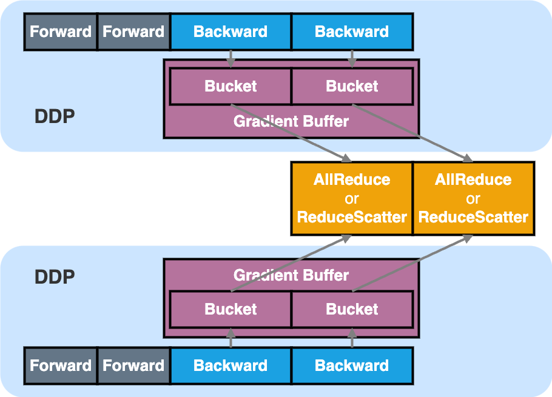

# veScale Distributed Data Parallel (DDP)

## TLDR



## What is DDP?

`Distributed Data Parallel` (`DDP`) is the most used parallelism strategy for distributed training. It partitions the input data batch across multiple devices, replicates the model on each device, and synchronizes gradient (e.g. with `AllReduce`) in the background.

veScale `DDP` is primarily inherited from [Megatron-LM's DDP](https://github.com/NVIDIA/Megatron-LM/blob/main/megatron/core/distributed/distributed_data_parallel.py) for its performance and compatibility with ZeRO optimizer. We extend and enhance the original DDP with extra features surrounding veScale `DTensor` and `DModule`:

- conversion between `DTensor` and `Tensor` gradients

- support nested gradient synchronization with `DModule` (for Sequence Parallel)

- support gradient synchronization for dynamic control flow 


## How does DDP work?

`DDP` is a module (`DModule`) wrapper that creates a flattened _Gradient Buffer_ that stores the gradients produced by the model backward. 
(This is achieved by adding a hook to the `grad_fn` of the model parameters, which fills `DTensor` gradient outputed by PyTorch Autograd engine to the pre-allocated grad buffer.)
The purpose of _Gradient Buffer_ is to both accelerate gradient synchronization and reduce memory fragmentation, as it only needs to be performed once for the entire buffer, rather than once per parameter. 

For extreme performance, the _Gradient Buffer_ is further divided into multiple _Bucket_s such that the backward compute and gradient synchronization of each _Bucket_ can be overlapped. As soon as all gradients in a _Bucket_ are generated, we can immediately trigger the gradient synchronization rather than waiting until the whole _Gradient Buffer_ is ready.

The gradient synchronization can be either `AllReduce` or `ReduceScatter` under the DDP hood:

- `AllReduce` is used when no _ZeRO_ optimizer

- `ReduceScatter` is used when _ZeRO_ optimizer (e.g., `DistributedOptimizer`) exists

## How to use DDP?

```python
from vescale.ddp.distributed_data_parallel import DistributedDataParallel as DDP
from vescale.dmodule.api import parallelize_module
from vescale.dtensor.device_mesh import DeviceMesh

# create an torch-native model
mlp = MLP()

# create 2-dim DeviceMesh, the first for data-parallel, while the second for tensor-parallel.
device_mesh = DeviceMesh("cuda", [[0, 1], [2, 3]], mesh_dim_names=("DP", "TP"))

# parallelize torch-native model into TP model
tp_mlp = parallelize_module(mlp, device_mesh["TP"], sharding_plan)

# wrap TP model with `DDP`
dp_tp_mlp = DDP(
    # feed the TP model
    tp_mlp,
    # feed DP's sub-mesh or just `device_mesh` (i.e., by default we treat the first dim of devicemesh as data-parallelism).
    device_mesh["DP"], 
    # choose whether overlap gradient all-reduce with backward
    overlap_grad_reduce=True or False,
    # choose whether used `DistributedOptimizer`
    #   if True, `DDP` will be used with `DistributedOptimizer`, so `DDP` reduce-scatter the gradient along data-parallel ranks.
    #   if False, `DDP` just all-reduce the gradient along data-parallel ranks.
    use_distributed_optimizer=True or False
)

# train model
dp_tp_mlp(torch.rand(...)).sum().bakward()
# all-reduce / reduce-scatter the gradient across the DP world.
dp_tp_mlp.finish_grad_sync()
```

- APIs can be found in `<repo>/vescale/ddp/distributed_data_parallel.py`

- More examples can be found in `<repo>/test/parallel/ddp_optim/test_ddp.py`

