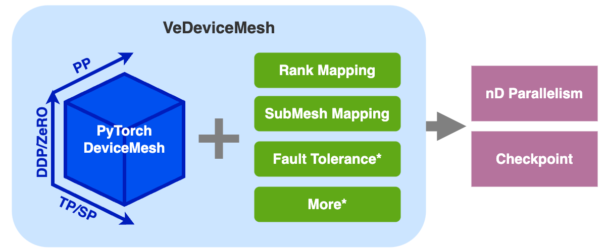

# VeDeviceMesh for nD Parallelism

## TLDR



(`*` is under development.)

## What is VeDeviceMesh?

`VeDeviceMesh (veScale Device Mesh)` is an advanced API that is built on top of PyTorch native's [`DeviceMesh`](https://pytorch.org/tutorials/recipes/distributed_device_mesh.html). This API enhances the existing capabilities of `DeviceMesh`, enabling effective _nD parallelism strategies_, _checkpointing_, and easy-to-use APIs, with ideals below:

- “A DeviceMesh, but better”

- One “Mesh” fits all: users don't need to worry about meddling with DeviceMesh and ProcessGroups' throughout the course of training. Additionally, users make the most out of the same DeviceMesh to enable hybrid parallelization training.

- Easy to extend: for more refined capabilities for imminent parallelization methods in the future, `VeDeviceMesh` provides mature APIs to extend new functionalities without breaking the semantics of communication

## How does VeDeviceMesh work?

`VeDeviceMesh` wraps around PyTorch `DeviceMesh` with APIs that seamlessly integrate with APIs of veScale's `DModule`, `DDP`, `DistributedOptimizer`, `Pipeline Parallel`, and `Checkpoint`.

`VeDeviceMesh` further implements advanced features surrounding `DeviceMesh`:
 
- rank mapping between local rank and global rank or between strategy coordinates and global rank

- submesh mapping between global mesh and submeshes or between local submesh and neighbor submeshes

- [in future] fault tolerance with reconfigurable meshes

## How to use VeDeviceMesh?

```python
from vescale.devicemesh_api import VESCALE_DEVICE_MESH 
from vescale.dmodule.api import parallelize_module
from vescale.ddp.distributed_data_parallel import DistributedDataParallel as DDP
from vescale.optim.distributed_optimizer import DistributedOptimizer
from ... import GPT

# create torch-native model as usual
model = GPT()

# initialize a VeDeviceMesh containing a global DeviceMesh with size of (2, 2)
VESCALE_DEVICE_MESH.init_device_mesh("cuda", mesh_shape=(2, 2), mesh_dim_names=("DP", "TP"))

# use VeDeviceMesh to obtain global DeviceMesh's tensor parallelism view
if VESCALE_DEVICE_MESH.get_strategy_size("TP") > 1:
    # wrap DModule (TP/SP)
    model = parallelize_module(model, VESCALE_DEVICE_MESH["TP"], sharding_plan, ...)

# use VeDeviceMesh to obtain global DeviceMesh's data parallelism view
if VESCALE_DEVICE_MESH.get_strategy_size("DP") > 1:
    # wrap DDP module
    model = DDP(model, VESCALE_DEVICE_MESH["DP"], ...)

# use VeDeviceMesh to build distributed optimizer
if VESCALE_DEVICE_MESH.get_strategy_size("DP") > 1:
    optimizer = DistributedOptimizer(torch.optim.Adam, models=[model], ...)

# Train model
for X, Y in data_set:
    optimizer.zero_grad()
    loss = model(X, Y)
    loss.backward()
    optimizer.step()
```

- APIs can be found in `<repo>/vescale/devicemesh_api/api.py`

- More examples can be found under `<repo>/test/parallel/devicemesh_api/*.py`