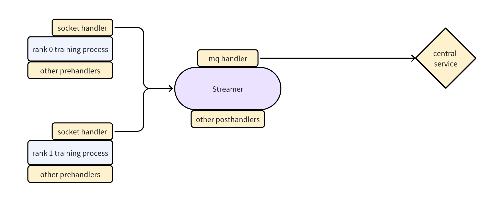
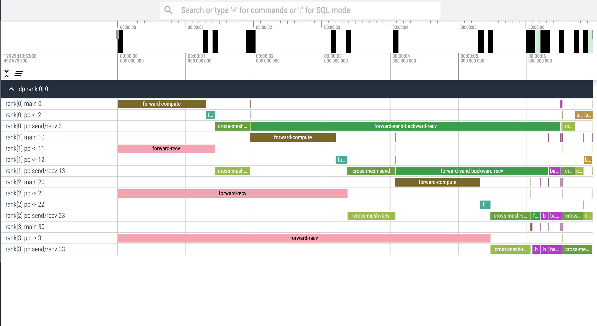

# ndtimeline (N-Dimension Timeline)

## Why ndtimeline?

- When training LLM (Large Language Models) on an extremely large scale, several challenges need to be overcome:

    - Sink machines (i.e. stragglers) tend to initiate CUDA kernels slowly, significantly reducing training efficiency.
    - Traditional tools such as torch profile/nsys can only offer information within one physical machine, whereas communication occurs among multiple or even thousands of machines.
    - Although torch profile can provide details about training, it comes at a considerable cost, making it impractical to be constantly enabled. The large size of the tracing file is also a significant issue, making analysis difficult.

- We require a mechanism to jointly collect and visualize training details across numerous machines with low costs and a small tracing log to effectively detect stragglers and confirm the training status.

## What is ndtimeline?

### Insights
- With `CUDA Events` provided by device, we can record durations of interesting parts.
- We can utilize a reference `CUDA Event` as a clock with a Unix timestamp, allowing comparisons between events to provide a full span that includes both the starting time and duration.
- Clocks among different machines are challenging to synchronize precisely, but we can simulate a global clock through communication to offer a consistent view of spans.
- To minimize overhead, we can record events in multiple stages and flush them in another thread at specific intervals
- To maximize flexibility, `ndtimeline` exposes handlers for users to inject during pre and post metric processing and perform any desired operations.
- As metric collectors are located in each training process, they ensure the same semantics as parallelism on each rank, facilitating the easy extension of ndtimeline when new types of parallelism are introduced.

### Architecture
Assume there are two ranks on one machine.

### important details
  - Communication Stream
    - Torch does not inherently offer an interface to obtain the stream for communication of nccl. `ProcessgroupNCCL` maintains a `CUDA Stream` pool and generates a stream from it when the user does not manually set the `CUDA Stream `before communication.
    - We modify torch to establish a new interface for this purpose.
    - An important **caveat**: The first communication operation will be lost in the tracing statistics because the `CUDA Stream` is allocated lazily when the first communication operation is initiated. Therefore, you may encounter some information logs such as `p2p stream is not available, skipped` as expected.
  - is_internal_vescale
    - We employ `ndtimeline` to emit metrics to an internal service, which may potentially disclose important secrets. Hence, we have to remove some `NDHandler` implementations and the corresponding meta information.

## How to use ndtimeline?
- Both **Higher** and **Lower** api are provided
  - `ndtimeline.api` provides three key higher apis: `init_ndtimers`, `wait` and `flush`
    - `init_ndtimers` Metrics injected in vescale are predefined in `ndtimeline.predefined`. The method for processing metrics, named as `NDHandler` defined in `ndtimeline.handlers`, can also be initialized using init_ndtimers.
    - `wait` ensures that metrics are flushed and should be called at the end of main.py.
    - `flush` flushes the collected metrics and calibrates the simulated global clock.
  - `ndtimeline.api` provides another two api: `inc_step` and `set_global_step`
    - They are introduced to align with the traditional approach for maintaining the global step instead of a `global_step_getter` function.
- **Lower** api are rather complex
  - Investigate `ndtimeline.timer.NDTimerManager` and `ndtimeline.sock_streamer.NDtimelineStreamer` to understand how to use them.

- An Example

  - Demo for default tracing file

  

  - Users can utilize `init_ndtimers` and pass `ndtimeline.handlers.LocalTimelineNDHandler` as the post handler. A tracing file on the machine will then be generated in the current directory.
  - Using the Chrome built-in tracing file viewer at https://ui.perfetto.dev/, one can visualize the tracing file.
  - In case you need a tracing file related to ranks on different machines, you can implement an MQHandler by yourself and send all metrics to a central storage. This provides you with a method to filter and generate the tracing file for specified ranks.