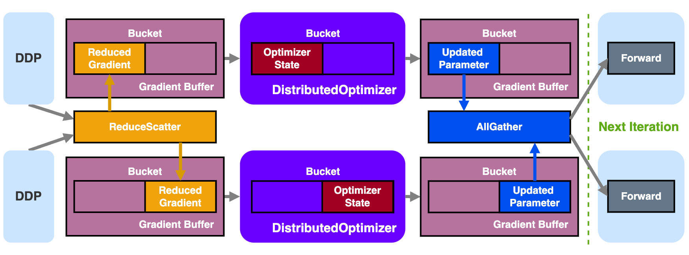

# veScale Optimizer Parallel

## TLDR



## Overview

In veScale, we provide two optimizers for _Optimizer Parallel_:

- `DistributedOptimizer`

- `BasicOptimizer`

### veScale `DistributedOptimizer`

#### What is it?

`DistributedOptimizer` is a _ZeRO 2+_ optimizer. Similar to the original _ZeRO2_, it parallelizes model gradient and optimizer states along _Data Parallel_ dimension. Differently, it further parallelizes model parameters virtually but not physically.

`DistributedOptimizer` is primarily inherited from [Megatron-LM's DistributedOptimizer](https://github.com/NVIDIA/Megatron-LM/blob/main/megatron/core/optimizer/distrib_optimizer.py) for its performance and mostly due to the lacking of _ZeRO2_ optimizer in native PyTorch. We extend and enhance `DistributedOptimizer` with extra features:

- convert between `Tensor` and `DTensor`

- support online resharding of optimzier state

#### How does it work?

In `DistributedOptimizer`, the model gradients and optimizer states are sharded along _Data Parallel_ dimension in each gradient _Bucket_ of _Gradient Buffer_ (see `DDP` for more details), where each DP rank only manages its own shard of gradient, generates its own shard of optimizer states, and updates its own shard of parameters.

The flow of `DistributedOptimizer` is as follows:

0. During initialization, model parameters are virtually sharded across all DP ranks, such that each DP rank owns a partial view of the original model parameters
 - This sharding does not respect parameter boundaries, i.e., a parameter could be split into two halves and belong to two DP ranks. Therefore, a complex mapping between the sharded parameters and the original parameters is established, which is mostly done in the `__init__` function. Then the optimizer's `param_groups` is replaced with the _Sharded Parameter_.

1. Receive _Reduced Gradient_ resulting from `ReduceScatter` per Gradient _Bucket_ in `DDP`

2. Attach _Reduced Gradient_ (`main_grad` of each original parameter) to the _Sharded Parameter_

3. Run the actual `optimizer.step()` to generate _Optimizer State_ of each shard and updates _Sharded Parameter_ with _Reduced Gradient_

4. Copy the updated _Sharded Parameter_ to a specific parameter buffer and get ready for `AllGather` communication to restore the full parameters

 - To avoid the performance overhead and memory cost of per-parameter `AllGather`, the _Gradient Buffer_ of `DDP` is reused as the communication buffer for `AllGather`.
  
5. Overlap the parameter `AllGather` with the forward computation in the next iteration for hiding communication overhead, similar to gradient `ReduceScater` overlap with backward computation

#### How to use it?

```python
from vescale.ddp.distributed_data_parallel import DistributedDataParallel as DDP
from vescale.optim.distributed_optimizer import DistributedOptimizer
from vescale.dmodule.api import parallelize_module
from vescale.dtensor.device_mesh import DeviceMesh

# create an torch-native model
mlp = MLP()

# create 2-dim DeviceMesh, the first for data-parallel, while the second for tensor-parallel.
device_mesh = DeviceMesh("cuda", [[0, 1], [2, 3]], mesh_dim_names=("DP", "TP"))

# parallelize torch-native model into TP model
tp_mlp = parallelize_module(mlp, device_mesh["TP"], sharding_plan)

# wrap TP model with `DDP`
dp_tp_mlp = DDP(
    module=tp_mlp,
    device_mesh["DP"],
    use_distributed_optimizer=True
)

# create DistributedOptimizer
doptim = DistributedOptimizer(
    # choose core optimizer class
    torch.optim.Adam,
    # feed model
    models=[dp_tp_mlp],
    # choose whether overlap the param all-gather with the next forward for speeding up
    overlap_param_gather=True or False,
    # feed core optimizer kwargs
    optimizer_kwargs={"lr": 0.01},
)

# training current iteration
dp_tp_mlp(torch.rand(...)).sum().bakward()
# reduce-scatter the gradient across the DP world.
dp_tp_mlp.finish_grad_sync()
# update model
doptim.step()

# training next iteration
doptim.zero_grad()
# <repeat above>

```

APIs can found in: `<repo>/vescale/optim/distributed_optimizer.py`.

More examples can found in: `<repo>/test/parallel/ddp_optim/test_doptimizer.py`.

### veScale `BasicOptimizer`

`BasicOptimizer` is a not ZeRO optimizer but a simple optimizer that works like _Data Parallel_ which replicates parameters, gradients, and optimizer states along _Data Parallel_ dimension.

`BasicOptimizer` itself is nothing but a simple wrapper that wraps given optimizer instance with utilities for veScale `DTensor`, `DModule`, and `DDP`:

- convert between `Tensor` and `DTensor`

- recover flattened gradient from `DDP` 

- trigger gradient synchronization of `DModule` (e.g., for Sequence Parallel) 


APIs can be found in: `<repo>/vescale/optim/base_optimizer.py`.

Examples can be found in `<repo>/test/parallel/ddp_optim/test_ddp.py`. 


## How are these optimizers related with `DDP`?

The compatibility of the above optimizers with `DDP` is as follows:

|          | `BasicOptimizer` | `DistributedOptimizer` |
| -------- | ---------------- | ---------------------- |
| `DDP`    |      yes         |        yes             |
| NO `DDP` |      yes         |         no             |
